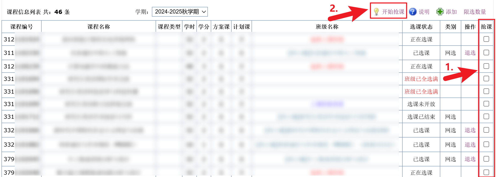

# BUPT-Course-Killer

## 介绍

本项目是一个用于辅助北邮研究生系统选课的、适用于 Chrome/Chromium 内核的浏览器扩展程序，可以帮助大家自动抢课，提高选课成功率。

## 使用方法

### 1. 下载源码

```bash
git clone https://github.com/Albresky/BUPT-Course-Killer.git
```

（或者直接下载压缩包 [BUPT-Course-Killer](https://github.com/Albresky/BUPT-Course-Killer/archive/refs/heads/main.zip)， 此时需要解压缩 `BUPT-Course-Killer.zip` 至文件夹 `./BUPT-Course-Killer`）


### 2. 启用浏览器扩展程序的开发者模式

 - 浏览器访问 [chrome://extensions/](chrome://extensions/)

 - 点击 `加载已解压的扩展程序`，选择 `./BUPT-Course-Killer` 文件夹


### 3. 进入选课系统
    
  - 访问 [北邮研究生信息数字化管理系统](https://yjxt.bupt.edu.cn/)
    
  - 登录后进入 `选课专用通道` 并选择一个选课服务器
  - 右侧 `抢课` 一栏中勾选候选课程复选框
  - 点击 `开始抢课` 按钮进行抢课



## 注意事项

- 本项目仅供学习交流使用，不得用于任何商业用途
- 本项目若产生任何不当行为，请相关人员联系，本人将第一时间删除